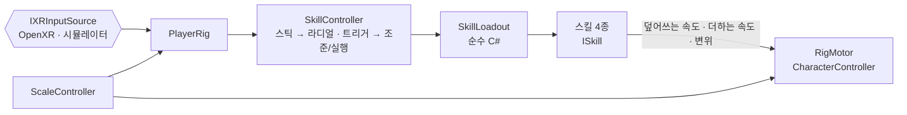

# unity-xr-locomotion-skills


-brightgreen)
-brightgreen)


**툴킷 없이 직접 구현한 VR 이동 스킬** — 스킬 슬롯 프레임워크(쿨타임·수량·잠금), 스틱 라디얼 선택, 훅샷, 부스터, 백스텝, 큐브 발판, 플레이어 크기 변경 보정.

라이브 VR 멀티플레이 게임 개발 중 해결한 문제를 회사 코드 없이 범용으로 다시 구현했습니다.

**이 저장소는 기능 데모가 아니라 코드 샘플입니다.** 판정 규칙은 전부 UnityEngine 참조가 없는 C# 어셈블리에 있고, 73개 EditMode 테스트가 동작을 고정합니다. 데모 씬은 확인용으로만 두었습니다.

이 저장소는 Claude Code와 함께 작성했습니다. 문제 정의·설계·테스트 시나리오·검증 판정과 최종 결정은 본인이 했고, 구현 초안과 반복 작업은 AI가 보조했습니다. 커밋 이력의 `Co-Authored-By` 트레일러가 그 기록입니다.

## 읽는 순서

코드를 보러 오셨다면 이 순서를 권합니다. 전부 `Packages/com.jongreul.xr-locomotion/` 아래에 있습니다.

| # | 파일 | 무엇을 보면 되는지 |
|---|---|---|
| 1 | `Runtime/Core/Framework/SkillLoadout.cs` | 스킬 4종이 공유하는 규칙 하나. 조준·실행·거절·쿨타임 시작점·수량 차감 시점·서로 잠금 |
| 2 | `Tests/EditMode/Framework/SkillLoadoutTests.cs` | "조준만 하고 취소하면 공짜", "쿨타임은 끝난 순간부터" 같은 규칙을 이름으로 읽을 수 있는 테스트 16개 |
| 3 | `Runtime/Core/Skills/HookPull.cs` | 가속·감속 곡선으로 도착 지점을 넘지 않는 당기기, 막히면 제한 시간에 풀림 |
| 4 | `Runtime/Core/Skills/BackStep.cs` · `Booster.cs` | 뒤 벽 거리로 잘라 내는 대시, 연료·재충전·관성 |
| 5 | `Runtime/Core/Radial/RadialSelector.cs` | 스틱 각도 → 칸, 데드존, 경계 여유 각도로 흔들림 방지 |
| 6 | `Runtime/Core/Scale/ScaleAdapter.cs` | 1배 기준값에서 비례 계산. 20번 왕복해도 오차 0인 이유 |
| 7 | `Runtime/Core/Skills/CubePlatforms.cs` | 발판 개수 상한·수명·밟으면 연장 |

---

## 이 저장소가 푸는 문제

- **스킬마다 입력·쿨타임·수량·겹침 규칙을 따로 짜면 어긋난다.** 훅샷을 당기는 중에 부스터가 켜지거나, 조준만 하고 취소했는데 수량이 줄거나, 쿨타임이 실행 순간부터 돌아 긴 스킬은 끝나자마자 다시 쓸 수 있게 된다.
- **VR에서 스킬 선택은 손을 떼지 않고 해야 한다.** 스틱 방향 선택은 경계에서 칸이 흔들리고, 손을 놓는 순간 선택이 튀면 안 된다.
- **몸을 옮기는 스킬은 벽과 싸운다.** 훅은 아래에서 턱 윗면을 볼 수 없고, 백스텝은 뒤 벽을 뚫고, 당기는 동안 벽에 막히면 영원히 당긴다.
- **플레이어 크기가 바뀌면 여러 값이 같이 틀어진다.** 이동 속도·손 도달·몸 캡슐·카메라 근접 클리핑·UI 거리·소리 감쇠가 모두 크기에 비례해야 하고, 여러 번 커졌다 작아져도 1배로 돌아오면 정확히 원래 값이어야 한다.

## 설계



### 구성 요소

| 영역 | 클래스 | 책임 |
|---|---|---|
| 스킬 프레임워크 | `ISkill` · `SkillLoadout` | 누르면 조준·떼면 실행, 거절 규칙(빈 슬롯·쿨타임·수량·잠금 스킬 실행 중), 수량은 실제 발동 때만, 쿨타임은 끝난 순간부터, 조준 중 다른 슬롯을 고르면 조준 취소, 시작·끝·거절 이벤트 |
| 라디얼 선택 | `RadialSelector` → `SkillController` · `RadialMenu` | 스틱 각도 → 칸(위 = 0번, 시계 방향), 데드존, 경계 여유 각도(흔들림 방지), 스틱을 놓으면 확정. 메뉴는 칸마다 쿨타임 점·남은 수량, 닫혀 있으면 선택 스킬 상태 한 줄, 거절되면 이유 |
| 훅샷 | `HookPull` → `HookShotSkill` | 가속·최고 속도·도착 전 감속 곡선, 도착 지점을 넘지 않음, 막히면 제한 시간에 풀림. 조준선·표적 색, 걸 수 없는 레이어(유리) 거절, 벽면 윗부분에 걸면 윗면으로 올라서기(맨틀) |
| 부스터 | `Booster` → `BoosterSkill` | 시선 수평 방향 추진(공중에서는 약하게), 연료·재충전 지연, 끝난 뒤 반감기 관성 |
| 백스텝 | `BackStep` → `BackStepSkill` | 시선 반대 수평 대시(감속 곡선), 몸 크기 캡슐 캐스트로 뒤 벽 거리를 재 그 앞까지만, 너무 가까우면 거절, 무적 시간 |
| 큐브 발판 | `CubePlatforms` → `MakeCubeSkill` | 손 앞 발 높이에 발판(구덩이를 건너는 다리), 최대 개수(가장 오래된 것부터 교체), 수명, 밟으면 연장(상한), 곧 사라지면 깜빡임 |
| 크기 보정 | `ScaleAdapter` → `ScaleController` · `ScalePad` | 1배 기준값에서 비례 계산(왕복해도 오차 없음), 로그 공간 전환. 트래킹 공간·이동 속도·몸 캡슐·잡는 반경·근접 클리핑·메뉴·소리 거리 적용 |
| 몸·입력 | `RigMotor` · `LocomotionRig` · `PlayerRig` · `Hand` · `DesktopHandSimulator` | CharacterController 충돌·중력·시선 기준 스틱 이동, 스킬용 세 통로. 손·그랩·입력은 [unity-xr-interaction-lab](https://github.com/jongreul2/unity-xr-interaction-lab)에서 이름공간만 바꿔 복사(이 저장소는 따로 실행된다) + 엄지 스틱 추가 |

```
Jongreul.XrLocomotion.Core   순수 C# (noEngineReferences, System.Numerics) — 판정 규칙 전부
Jongreul.XrLocomotion        Unity 계층 — 입력·리그·모터·스킬 컴포넌트·메뉴·크기 보정
```

### 설계에서 고른 것

- **스킬은 모터에 직접 손대지 않는다** — 덮어쓰는 속도(훅: 이번 프레임만, 중력 끔) · 더하는 속도(부스터) · 변위(백스텝) 세 통로로만 부탁하고, 모터가 한 프레임에 한 번 CharacterController로 움직인다. 실행 순서: 입력(-100) → 스킬(-75·-70) → 모터(-50).
- **몸을 옮기는 스킬은 서로 잠근다** — `LocksOthers`. 큐브 발판처럼 몸을 옮기지 않는 스킬은 잠그지 않아 부스터 중에도 쓸 수 있다.
- **훅은 발을 당긴다** — CharacterController가 벽을 따라 미끄러지므로 벽면 윗부분에 걸면 몸이 벽을 타고 올라 윗면에 선다. 아래에서는 윗면이 안 보이므로 벽면 hit 뒤 위에서 아래로 쏴 윗면을 찾는다.
- **크기는 트래킹 공간을 바꾸고 몸 캡슐은 직접 맞춘다** — 머리 높이·팔 길이·눈 사이 거리는 트래킹 공간 스케일로 함께 바뀌고, CharacterController의 높이·반경은 스케일 1인 루트에서 값으로 바꾼다(트랜스폼 스케일에 맡기지 않는다).
- **쿨타임·발판 수명은 게임 시간** — 일시정지·시간 배율을 따른다.

## 확인 방법

1. Unity **6000.3.9f1**로 열고 `Assets/Demos/LocomotionCourse.unity` → Play.
2. 숫자 키 **1–5**로 구역 출발점으로 이동(1 훅샷 · 2 부스터 · 3 백스텝 · 4 큐브 발판 · 5 크기).
3. 조작(시뮬레이터): **WASD** = 이동 · **IJKL** = 스킬 휠(I 위 HOOK · L 오른쪽 BOOST · K 아래 BACK · J 왼쪽 CUBE, 떼면 선택) · **오른쪽 버튼** 누르고 있기 = 조준 / 떼기 = 실행 · 마우스 = 손 · **R**+마우스 = 손 회전 · 방향키 = 시선.
   - **훅샷**: 턱 앞면 위쪽을 겨누면 초록 표적 — 떼면 당겨져 턱 위로 올라선다. 유리를 겨누면 빨강, 떼도 거절된다.
   - **부스터**: 시선 방향으로 튀어 나간다. 메뉴 상태 줄에 연료가 보인다.
   - **백스텝**: 뒤 벽 앞에서 멈춘다. 무적 동안 손이 흰색으로 깜빡인다.
   - **큐브 발판**: 구덩이 앞에서 쓰면 발 높이에 발판이 생긴다. 걸어 나가며 이어 만들면 건너편에 닿는다(최대 3개, 남은 수량 6).
   - **크기**: 발판(x0.5 · x1 · x2)에 올라서면 크기가 바뀐다. 작아지면 낮은 굴을 지나갈 수 있다.
4. 헤드셋: XR Plug-in Management에서 OpenXR을 켜면 같은 씬이 실기기 입력(왼손 스틱 이동, 오른손 스틱 선택, 오른손 트리거)으로 돈다.

## 검증

| 구분 | 수 | 내용 |
|---|---|---|
| EditMode (Core) | **73** | 스킬 슬롯 16 · 라디얼 9 · 훅 당기기 7 · 부스터 6 · 백스텝 9 · 큐브 발판 6 · 크기 보정 9 · (복사한 코어) 던지기 속도 6 · 그립 오프셋 5 |
| PlayMode | **9** | 스틱 이동·중력 · 라디얼 선택 · 훅 맨틀 · 유리 거절 · 부스터 · 백스텝 벽 앞 정지 · 큐브로 구덩이 건너기 · 크기 2배와 복원 |

대표 테스트:

- **쿨타임은 끝난 순간부터** — 실행 중 시계를 5초 돌려도 쿨타임 0, 끝나는 순간 2초.
- **조준만 하고 취소하면 공짜** — 수량·쿨타임 그대로. 스킬이 실행을 거절(표적 없음)해도 마찬가지.
- **훅은 넘어가지 않는다** — 모든 틱에서 도착 거리 이상, 먼 거리면 최고 속도까지 붙고 도착 직전 속도 2.5 m/s 미만. 막히면 3초에 풀린다.
- **백스텝은 벽 앞에서** — 1.5 m 뒤 벽이면 1.15 m만(여유 0.35), 0.5 m면 거절.
- **크기 왕복 오차 0** — 무작위 크기로 20번 바꾼 뒤 1배로 돌아오면 모든 값이 기준값과 `==`.
- **실제 프레임 루프** — 턱 앞면 위쪽을 겨눠 쏘면 발이 윗면(y 2 ± 0.08)에 선다 · 큐브 3개로 2.1 m 구덩이를 건너는 동안 발이 한 번도 바닥 아래로 내려가지 않는다.

속도·거리 값(훅 12 m/s · 부스터 8 m/s · 백스텝 2.5 m 등)은 **데모 기준 초기값**이다. 헤드셋 실측 튜닝은 아직 하지 않았다.

## 한계와 다음 단계

- **헤드셋 실측 전** — 모든 GIF와 테스트는 시뮬레이터 입력이다. 스틱 데드존·경계 여유 각도·스킬 속도는 실기에서 다시 잡아야 한다.
- **네트워크 없음** — 스킬 시작·끝 이벤트는 동기화를 거는 자리까지만. 권위·예측은 [unity-authority-request](https://github.com/jongreul2/unity-authority-request)의 응답 게이트와 같은 구조로 붙일 수 있다.
- **룸스케일 이동 미반영** — 몸 캡슐은 리그 원점에 있고 머리의 수평 이동을 따라가지 않는다.
- **표정/상태 아이콘 칸 없음** — 라디얼은 스킬 네 칸만.
- **소리 거리는 등록한 AudioSource만** — 데모에는 소리가 없다.
- **조립은 코드** — 기본 도형으로 만들었다. 실제 게임에서는 프리팹·아트가 들어갈 자리.

## 관련 포트폴리오

- 포트폴리오(Notion): [강종렬 포트폴리오 2026](https://app.notion.com/p/jongreulk/2026-3d849fd9829281cba738df3134fa9b8a)

---

### English summary

- VR locomotion skills built **without an interaction toolkit**: a skill-slot framework (aim on press, fire on release, cooldowns that start when a skill ends, charges spent only on a real cast, movement skills lock each other), a thumbstick radial menu with hysteresis, hookshot with ledge mantling, booster, backstep with wall clamp, stepping-tile cubes, and player scale compensation.
- Rebuilt from scratch as a generic Unity package, based on problems solved while shipping a live multiplayer VR game (no company code).
- Skills never move the body directly: they ask a CharacterController motor through three channels (override velocity, additive velocity, displacement).
- All rules live in an engine-free C# assembly: 73 EditMode + 9 PlayMode tests. Input runs on OpenXR or a desktop hand simulator.
- Open `Assets/Demos/LocomotionCourse.unity`, press 1–5 to jump between sections.
